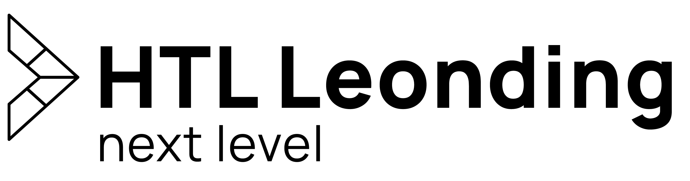



ITP-Projekt · HTL Leonding · 4AHITM

<h1>🎵 MusicVoting</h1>
<h3>Keine langweiligen Partys mehr</h3>

Die Gäste bestimmen die Musik – live, anonym, per Smartphone.

powered by




<ul>
<li>Der Gastgeber hat <strong>keine Zeit</strong>, sich um die Musik zu kümmern</li>
<li>… oder nicht den <strong>gleichen Geschmack</strong> wie die Gäste</li>
<li>Ergebnis: schlechte Stimmung auf der Party 😴</li>
</ul>




➕
<h4>Wünschen</h4>
Gäste suchen Songs und fügen sie zur Warteschlange hinzu.

❤️
<h4>Voten</h4>
Likes entscheiden, was als Nächstes läuft.

🔊
<h4>Abspielen</h4>
Die Musik läuft über den Spotify-Premium-Account des Gastgebers.





📱
<h4>Gast</h4>
Tritt anonym bei, sucht, wünscht und liked – ohne Account.

👑
<h4>Gastgeber</h4>
Erstellt die Party, wählt eine Standard-Playlist und steuert die Wiedergabe.

🖥️
<h4>Player (TV)</h4>
Spielt die Musik ab und zeigt QR-Code, aktuellen Song und Warteschlange.




<ul>
<li>Sortierung: <strong>mehr Likes zuerst</strong>, bei Gleichstand der ältere Wunsch</li>
<li>Keine Duplikate – nur der gerade laufende Song darf nochmal gewünscht werden</li>
<li>Jede Änderung erscheint <strong>sofort auf allen Geräten</strong></li>
</ul>




Wünscht gerade niemand etwas, füllt MusicVoting kurz vor Songende <strong>einen</strong> Song nach:

1 Standard-Playlist des Hosts

→

2 Ähnliche Songs der Party-Künstler

→

3 Top-Charts

→

4 Spotify-Suche

Wünsche der Gäste spielen <strong>immer zuerst</strong>.





☕
<h4>Backend</h4>
Quarkus (Java 21), REST + Server-Sent Events

🅰️
<h4>Frontend</h4>
Angular – Gast, Host und Player

🐘
<h4>Datenbank</h4>
PostgreSQL 16 – Quelle der Wahrheit für Warteschlange

📱
<h4>iOS-App</h4>
SwiftUI – Gast- und Host-Ansicht





<strong>Miriam Gnadlinger</strong>Project Lead

<strong>Simone Sperrer</strong>Team

<strong>Marlies Winklbauer</strong>Team

powered by





Die App läuft – einfach im Browser öffnen:

<a class="big-link" href="https://it220241.cloud.htl-leonding.ac.at">it220241.cloud.htl-leonding.ac.at</a>

